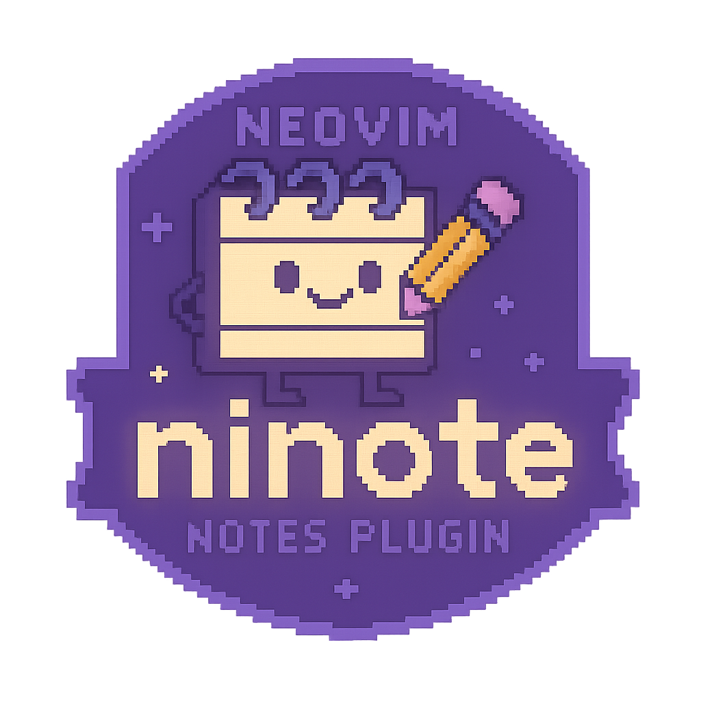

# 📝 ninote.nvim

> Um plugin minimalista de notas para o Neovim, feito com carinho — inspirado por simplicidade e fluxo contínuo de escrita.

---

## ✨ Visão geral

O `ninote.nvim` é um plugin de notas projetado para abrir uma nota flutuante rapidamente, permitir editar sem distrações e arquivar suas anotações com nomes automáticos ou definidos por você.

Ele é simples, direto, mas extensível — ideal para rascunhos rápidos, registros diários ou ideias durante o código.

---

## 📦 Principais funcionalidades

- 🔐 Abrir uma **nota atual** numa janela flutuante
- 🧘‍♂️ Experiência sem distrações: escreve e fecha com `q` (salvando)
- 📁 Arquivar nota com nome automático ou personalizado (`NinoteClose`)
- 🔍 Buscar por notas:
  - pelo conteúdo (com `fzf-lua` ou `telescope`)

---

## ⚙️ Instalação (com `lazy.nvim`)

```lua
{
  "jzes/ninote.nvim",
  config = function()
    require("ninote").setup({
      noteDir = "~/notas",         -- diretório onde as notas serão salvas
      NewNoteHeader = "Nova nota", -- título padrão de cada nota
      SearchEngine = "fzf-lua",    -- futuramente "telescope"
      OpenSearch = "float"         -- "float" ou "buffer"
    })
  end,
  dependencies = {
    { "ibhagwan/fzf-lua", optional = true },
    { "nvim-telescope/telescope.nvim", optional = true },
  },
}
```

## 📋 Comandos disponíveis

| Comando | Descrição|
| --- | --- | 
| :NinoteNew	| Abre (ou cria) a nota atual em modo flutuante |
| :NinoteClose	| Arquiva a nota atual com nome automático ou custom |
| :NinoteSearch	| Busca notas (conteúdo ou nome, com float/buffer) |

## 🔍 Busca de notas

Suporte a engines:

- fzf-lua (recomendado)

Configure em:

- SearchEngine = "fzf-lua",
- OpenSearch = "float", -- ou "buffer"

## 🧠 Exemplo de uso

-- Abrir nova nota
:NinoteNew

-- Escrever livremente, fechar com 'q' (salvando)

-- Arquivar a nota (com nome customizado ou automático)
:NinoteClose

-- Buscar entre notas
:NinoteSearch

## 📈 Roadmap (ideias futuras)

- Integração com mais buscadores
- Buscar por nome do arquivo
- Permitir integração com lualine para indicador de nota aberta

## ❤️ Créditos
Desenvolvido por @jzes

Coautor espiritual e conselheiro técnico: ChatGPT

Nerd Font Icons, fzf-lua, telescope.nvim — comunidade Neovim 💚

## 🔖 Licença
MIT — use, quebre, melhore e compartilhe.


